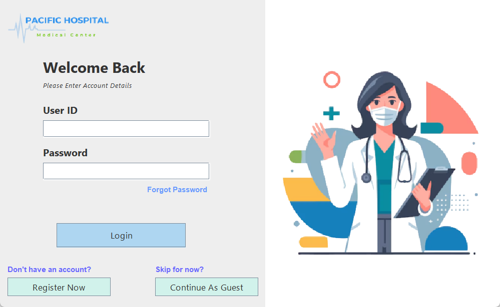
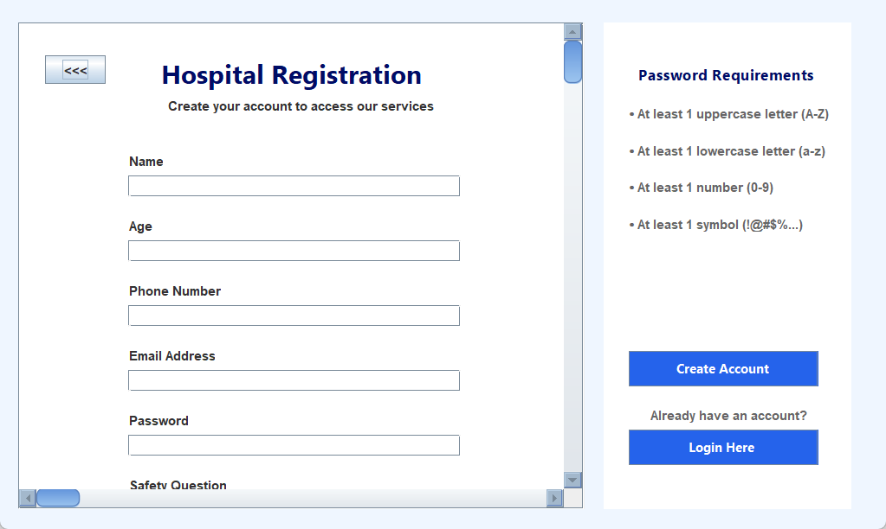
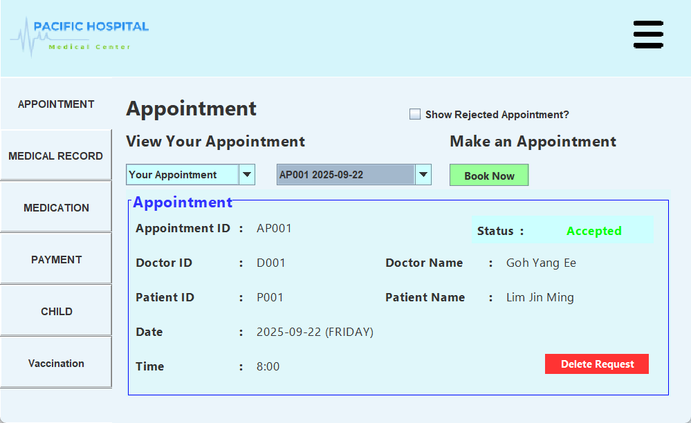
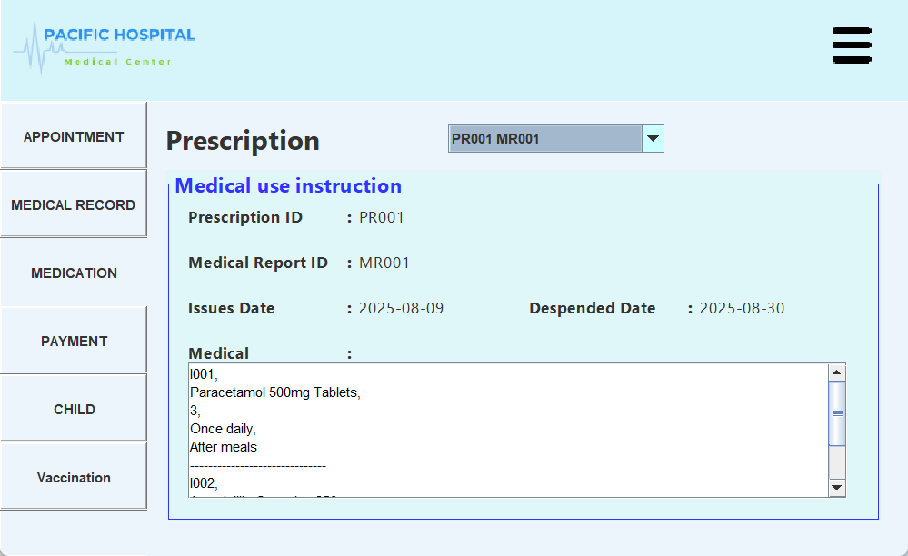
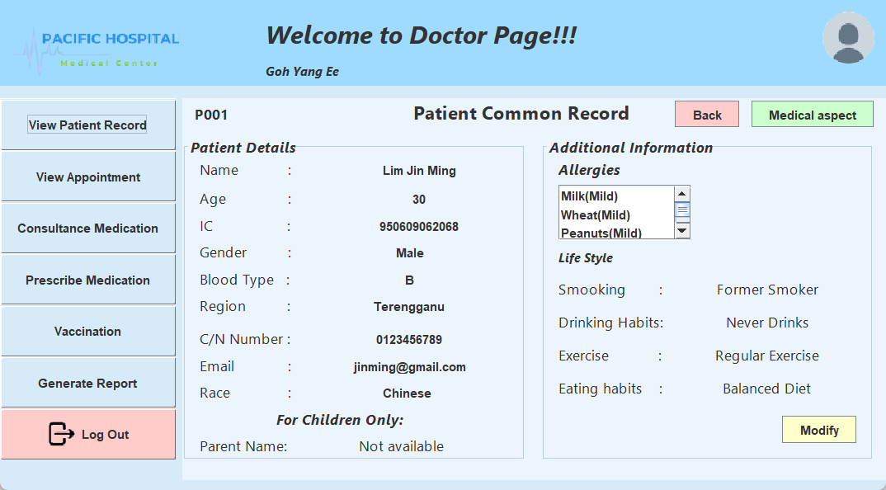
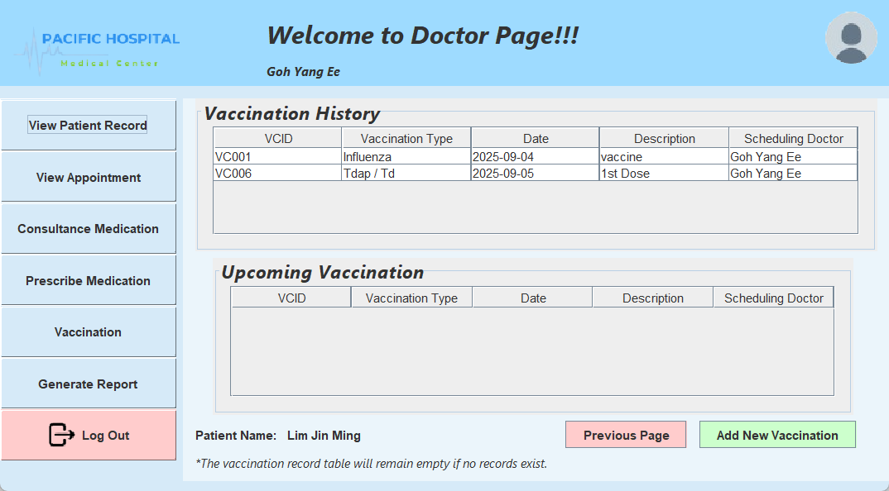
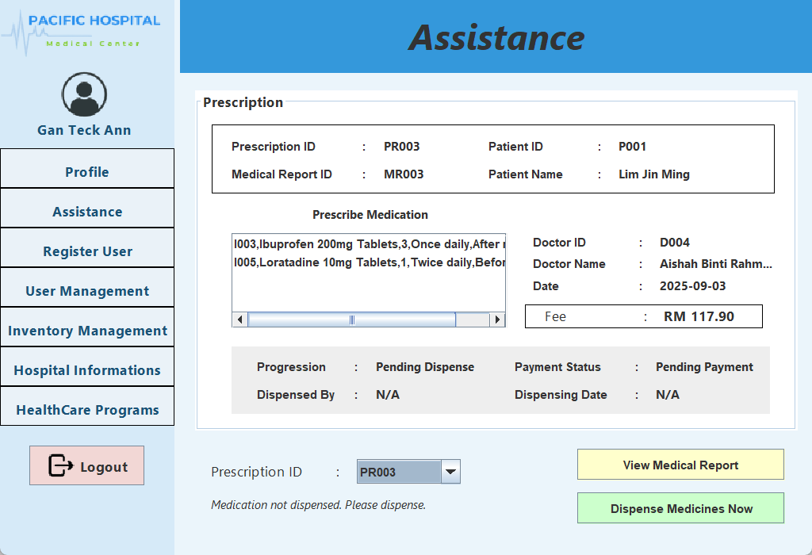
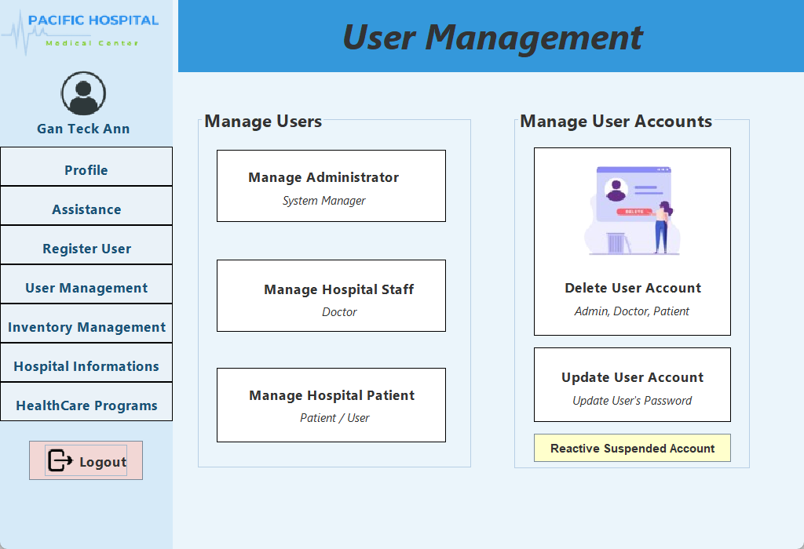

# 🏥 Pacific Hospital Management System – Bukit Jalil Medical Center

**Pacific Hospital Management System** is a desktop healthcare management platform developed using **Java Swing**.  
The system streamlines hospital operations, allowing **administrators, doctors, and patients** to manage medical records, appointments, prescriptions, and healthcare programs efficiently.

This system is tailored for the **Malaysian context**, requiring all users to have a valid **Malaysian Identity Card (IC)**, ensuring secure and compliant user profiles.

# 🌟 Vision & Mission

### Vision
To provide **efficient, transparent, and accessible healthcare services** for the local community in Bukit Jalil, Kuala Lumpur.

### Mission
- Facilitate seamless **patient-doctor-administrator interactions**.  
- Enable **secure management of medical records, prescriptions, and appointments**.  
- Provide a platform for **hospital programs, seminars, and healthcare awareness**.  
- Empower patients to **manage their own health information** in a user-friendly interface.

# 🛠️ Tech Stack

This project was developed using **core Java technologies only**, without external frameworks, as required by the module.

- **Frontend:** Java Swing (GUI)  
- **Backend:** Java (OOP Concept)  
- **Storage:** Txt File Storage  

# 🚀 Key Features

The system uses **Role-Based Access Control (RBAC)** with three main roles: **Administrator, Doctor, and Patient**.  
A **Guest** can only browse publicly available hospital information.

### 👤 User Roles & Capabilities

#### Guest (Public Access)
- Browse hospital services and specialties  
- View doctor profiles  
- Explore and register for healthcare programs (seminars and talks)  

#### Patient
- Self-register using Malaysian IC  
- Manage children accounts and appointments  
- Book medical consultations  
- View personal medical records, prescriptions, and vaccination details  
- Make in-system payments and generate receipts  

#### Doctor
- Access comprehensive patient records including allergies and lifestyle info  
- Approve or reject appointments  
- Create medical records, prescribe medications, and schedule vaccinations  
- Generate reports filtered by disease, gender, region, and payment status  

#### Administrator
- Register, update, delete, or reactivate user accounts  
- Dispense medication with auto-updating inventory
- Manage inventory and generate stock level report 
- Manage hospital information, visiting hours, and healthcare programs
- Manage hospital healthcare programs by register, view, update, and delete programs

# 📸 Demo

Here are some screenshots demonstrating the key features of the system:

### Login & Guest

### Patient

### Doctor

### Administrator

# 📜 Declarations

- This project is developed for **educational purposes**, simulating a real hospital management system.  
- It demonstrates **OOP principles, role-based access, Java fundamental and GUI design**.  
- Developed by: Gan Teck Ann, Goh Yang Ee, Cynthia Tan Xin Ru, Lim Jin Ming.

| Name | Responsibility |
|------|----------------|
| Gan Teck Ann | Admin Role |
| Goh Yang Ee | Doctor Role |
| Cynthia Tan Xin Ru | Guest Role |
| Lim Jin Ming | Patient Role |
